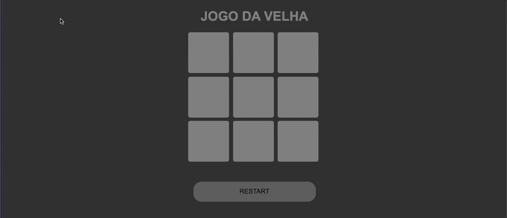

<h1 align="center">✖️⚫ Jogo da Velha ⚫✖️</h1>

    <h2>📸 Preview:</h2>
    

 

    <h2>💻 O Projeto:</h2>
    
 - Projeto desenvolvido sobre o padrão de software Model-View-Controller (divide a parte visual da lógica do jogo)

    
 - Jogo da velha clássico, com emojis representando os jogadores;

    
 - Botão de restart para reiniciar o jogo;

    
 - Mensagem na tela parabenizando e indicando o jogador que ganhou.

    <h3>Projeto feito com:</h3>
    
 - HTML

    
 - CSS

    
 - JavaScript

